# Aircraft plugin for Godot

This plugin adds wing physics to `VehicleBody3D` via the `VehicleWing3D` node.

## Installation

Copy `addons/aircraft` directory to project.

## Documentation

Detailed documentation can be found in the plugin scripts or Godot Editor: go to the script editor, click `Search Help` in the top bar and search for `VehicleWing3D`.

How to setup an airplane:
- Add VehicleWing3D to VehicleBody3D:
 
- Adjust the wing shape:
 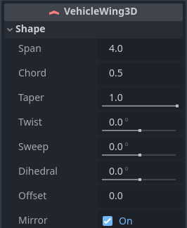
 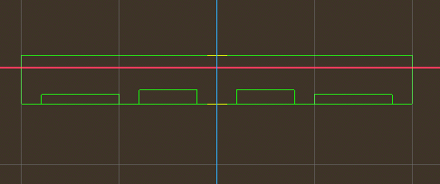
 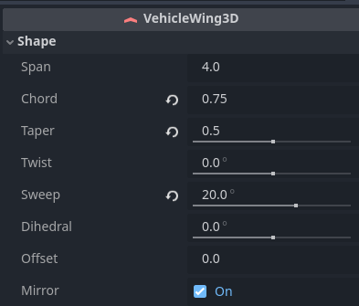
 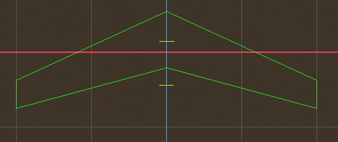
- Adjust control surfaces:
 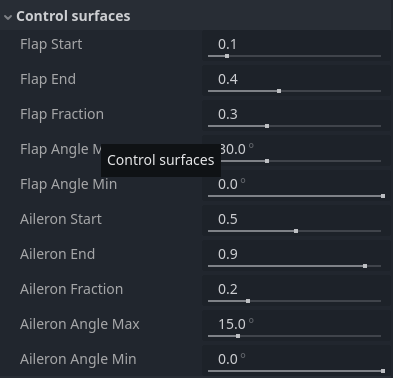
 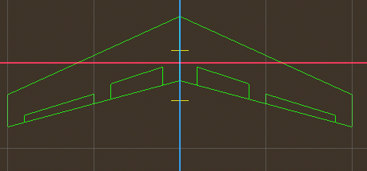
- Similarly, add tail empennage:
 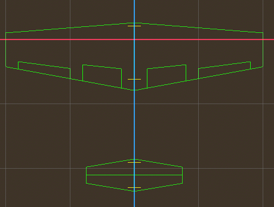
 Turn off the `mirror` property of the rudder and rotate 90 degrees around the z-axis
 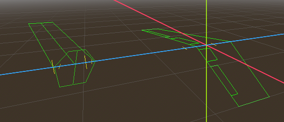
- Controls for each `VehicleWing3D`:
  - Ailerons deflect in different directions on different sides of the wing
  - Flaps deflect in same directions on different sides of the wing. They should be used for tail empennage.
 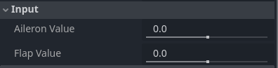
- Aerodynamic settings:
  - By default, it's configured for a standard wing, except for zero_lift_angle - this should be set to about -2.5 degrees on the main wing and 0.0 on tail empennage
 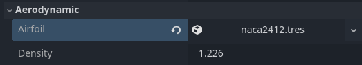

Position the center of mass near the wing location, setup the mass corresponding to the wing size, disable damping, apply aircraft thrust, and enjoy the flight
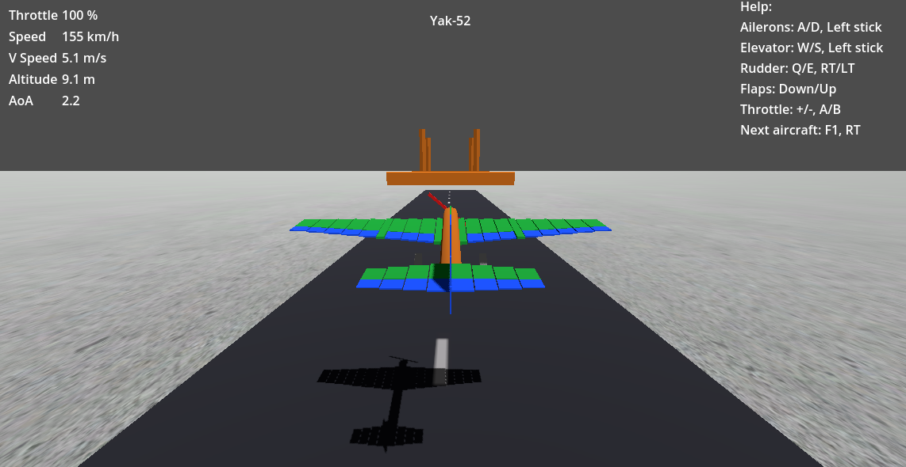

## Demo

This demo simulates 2 aircraft using `VehicleWing3D` nodes.

Wings are displayed as multiple debug sections in different colors:
- Green - normal state
- Orange - stall warning
- Red - stall
- Blue - control surface

Controls:
- Ailerons: <kbd>A/D</kbd>, <kbd>Gamepad Horizontal Axis Of Left Stick</kbd>
- Elevator: <kbd>W/S</kbd>, <kbd>Gamepad Vertical Axis Of Left Stick</kbd>
- Rudder: <kbd>Q/E</kbd>, <kbd>Gamepad Left/Right Trigger</kbd>
- Flaps: <kbd>Down/Up</kbd>, <kbd>Gamepad D-Pad Down/Up</kbd>
- Throttle: <kbd>+/-</kbd>, <kbd>Gamepad A/B</kbd>
- Brake: <kbd>Space</kbd>, <kbd>Gamepad X</kbd>
- Spawn next aircraft: <kbd>F1</kbd>, <kbd>Gamepad Right Bumper</kbd>

The player_aircraft_controller.gd script implements aircraft controls.

Basic parameters of aircraft:
- Cessna-172:
  - Mass: 750 kg
  - Wing distance to mass of center: 0.05 m
  - Wing span: 11.0 m
  - Wing chord: 1.5 m
  - Wing dihedral: 1.7 degree
  - Wing twist: -3.0 degree
  - Wing zero lift angle: -2.5 degree
- Yak-52:
  - Mass: 1000 kg
  - Wing distance to mass of center: 0.1 m
  - Wing span: 9.3 m
  - Wing chord: 2.1 m
  - Wing taper: 0.5
  - Wing sweep: -1.0 degree
  - Wing dihedral: 2.0 degree
  - Wing twist: -2.5 degree
  - Wing zero lift angle: -2.0 degree

Language: GDScript

Renderer: Forward+
